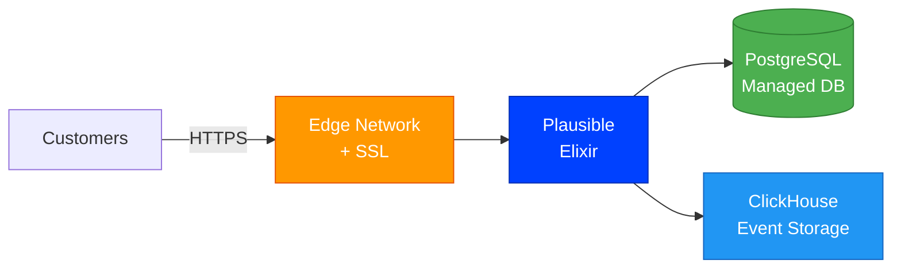
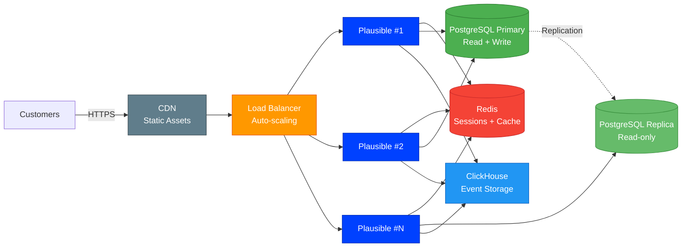

# Plausible [](https://github.com/stackblaze-templates/plausible) [](https://stackblaze.com) [](https://github.com/stackblaze-templates/plausible/actions) [](LICENSE) [](https://stackblaze.com)

<p align="center"></p>

Simple and privacy-friendly web analytics. Lightweight (<1KB script), no cookies, fully GDPR/CCPA compliant.

> **Credits**: Built on [Plausible](https://plausible.io) by [Plausible Analytics](https://github.com/plausible). All trademarks belong to their respective owners.

## Local Development

```bash
docker compose up
```

See the project files for configuration details.

## Deploy on StackBlaze

[](https://stackblaze.com)

This template includes a `stackblaze.yaml` for one-click deployment on [StackBlaze](https://stackblaze.com). Both options run on **Kubernetes** for reliability and scalability.

<details>
<summary><strong>Standard Deployment</strong> — Single-instance Kubernetes setup for startups and moderate traffic</summary>

<br/>



**What you get:**
- Single Plausible instance on Kubernetes
- Managed PostgreSQL database
- Automatic SSL/TLS via StackBlaze edge network
- Managed ClickHouse for event storage
- Automated daily backups
- Zero-downtime deploys

**Best for:** Development, staging, and moderate-traffic production environments.

</details>

<details>
<summary><strong>High Availability Deployment</strong> — Multi-instance Kubernetes setup for business-critical production</summary>

<br/>



**What you get:**
- Auto-scaling Plausible pods on Kubernetes behind a load balancer
- Redis for shared sessions, cache, and queue management
- PostgreSQL primary + read replica for high throughput
- CDN for static assets
- Managed ClickHouse cluster for event storage
- Automated failover and self-healing
- Zero-downtime rolling deploys

**Best for:** Production workloads, high-traffic applications, business-critical deployments.

</details>

---

## Security Configuration

Before exposing Plausible to the internet, set these environment variables — **never use the defaults in production**.

| Variable | Required | Description |
|---|---|---|
| `SECRET_KEY_BASE` | ✅ Yes | 64-character random secret. Generate: `openssl rand -base64 48` |
| `DATABASE_URL` | ✅ Yes | Full PostgreSQL connection string including a strong password |
| `BASE_URL` | ✅ Yes | Public HTTPS URL of your Plausible instance |

**Insecure defaults to change before production:**

- `SECRET_KEY_BASE` — the placeholder value in `docker-compose.yml` is not a secret; replace it.
- `POSTGRES_PASSWORD` — the default `plausible` password is well-known; use a strong unique password.
- `BASE_URL` — update to your real HTTPS domain so cookies are flagged `Secure`.

Copy `.env.example` to `.env`, fill in real values, and pass them to the containers. The `.env` file is excluded from version control by `.gitignore`.

---

### Maintained by [StackBlaze](https://stackblaze.com)

This template is actively maintained by StackBlaze. We perform **weekly automated checks** to ensure:

- **Up-to-date dependencies** — frameworks, libraries, and base images are kept current
- **Security scanning** — continuous monitoring for known vulnerabilities and CVEs
- **Best practices** — configurations follow current recommendations from upstream projects

Found an issue? [Open a ticket](https://github.com/stackblaze-templates/plausible/issues).
